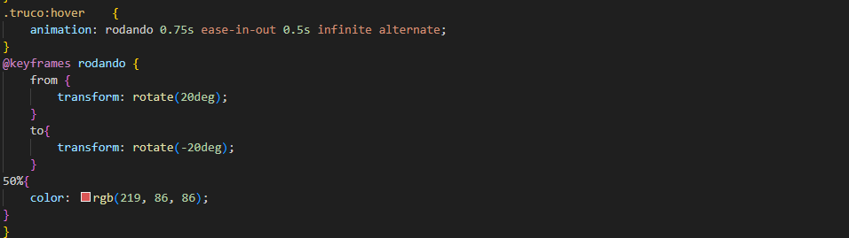
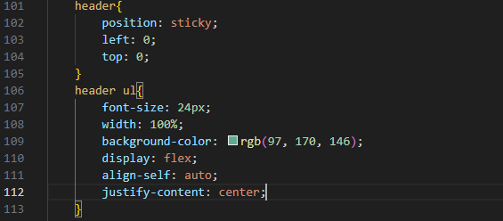
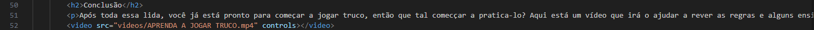
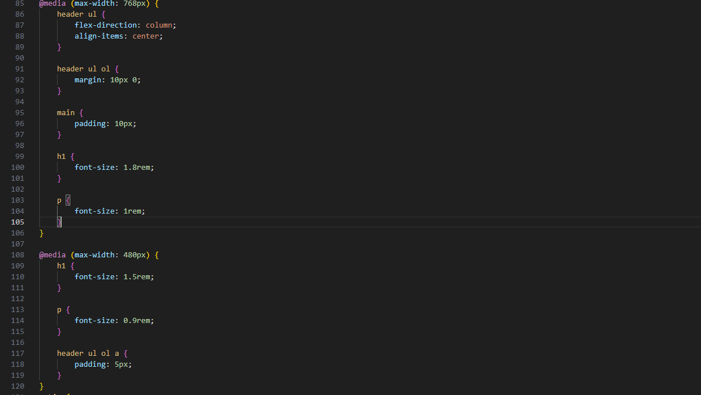

Artur Dias Alves Pires - Truco

URL do site: https://arturdias2.github.io/site_truco_lpw/
Itens opcionais implementados:  
      (5-10%) Colocar animações, transições e transformações (mas sem exageros, onde ficar bom e fizer sentido) e (2-5%) Easter eggs usando CSS ou JavaScript (mais pontos)  
      
      (3-6%) Usar flexbox e grid e (5%) Alguns elementos com posicionamento não estático  
      
     (3%) Exibição de um vídeo sobre o tema  
      
     (5%) Fazer o site todo completamente responsive  
      
